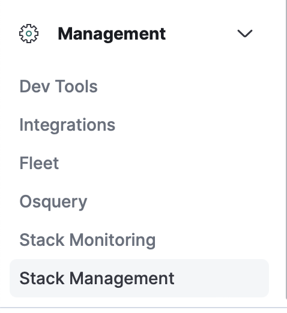
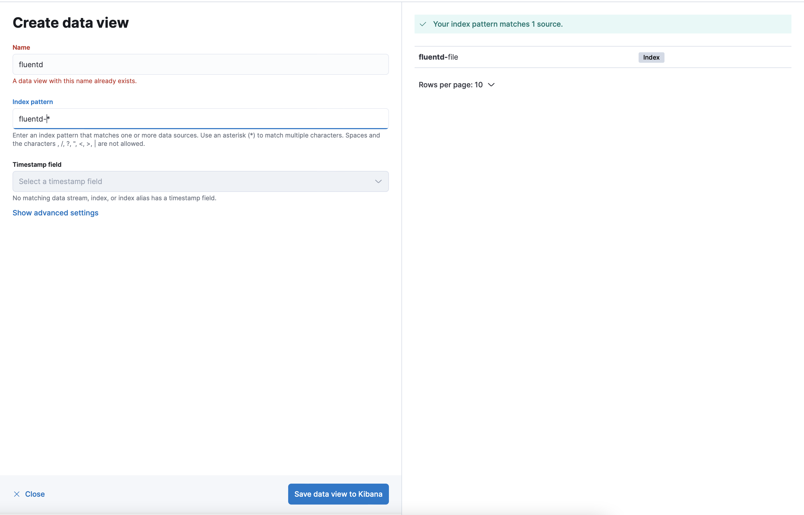
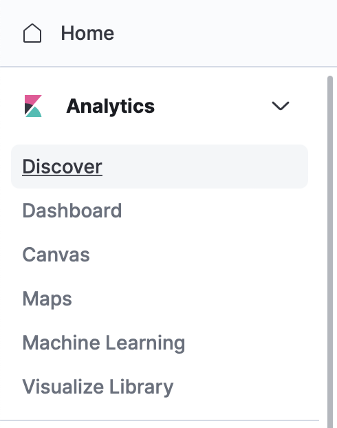
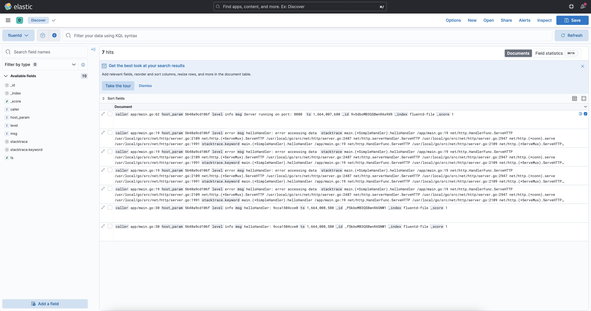

# Fluentd Example
This project are fluentd demo project, that read simple http server log, and send the log to elasticsearch. There are two docker-compose file for running the demo project. quickstart.yaml and quickstart-elastic.yaml


- **quickstart.yaml** docker compose file is use for demo that fluentd read log from http server log and send the log file to our local log file

- **quickstart-elastic.yaml** docker compose file is use for demo that fluentd read log from http server log and send the log file to elasticsearch

### Testing Simple http server
This command below is use to run http simple server and redirect the stdout and stderr to a file. this command use to check if http log are write to out local file
```shell
go run main.go -port=8081 > log.json 2>&1
```

## Build And Run
You can build or running this demo example, you can follow this steps below.
### Build simple app image
```shell
docker build -t simpleapp-withlog -f hack/myapp/Dockerfile .
```

### Docker compose
```shell
docker-compose -f hack/quickstart-elastic.yaml up
```

### Elasticsearch And Kibana
1. Navigate To ```Stack Management``` menu on the left
   <br>
   
2. Next Select ```Data View``` Menu
3. Click ```Create data view``` button
4. Then input data view _**Name**_,and _**Index Pattern**_ [Index Pattern Eg. fluentd-*] and save
   <br>
   
5. Open Side Menu and navigate to ```Discover```
   <br>
   
6. You will see the data from fluentd
   <br>
   